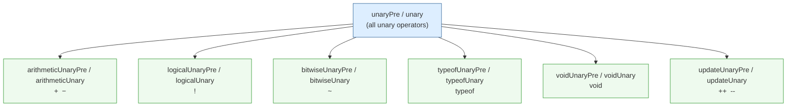
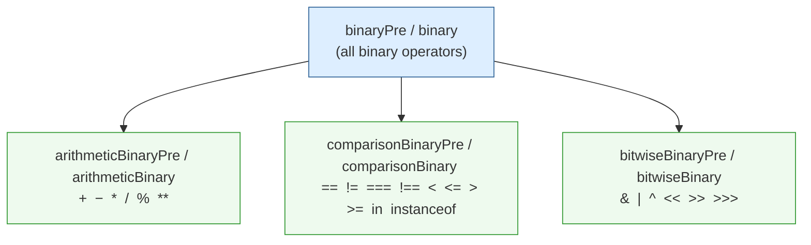
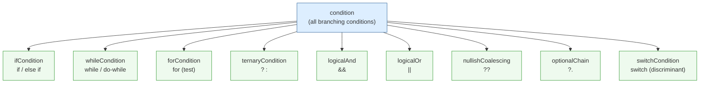
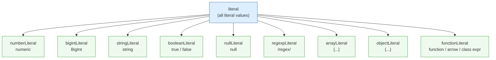
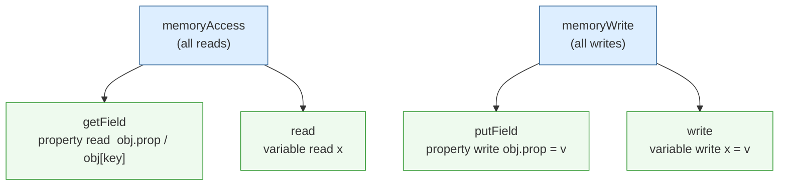
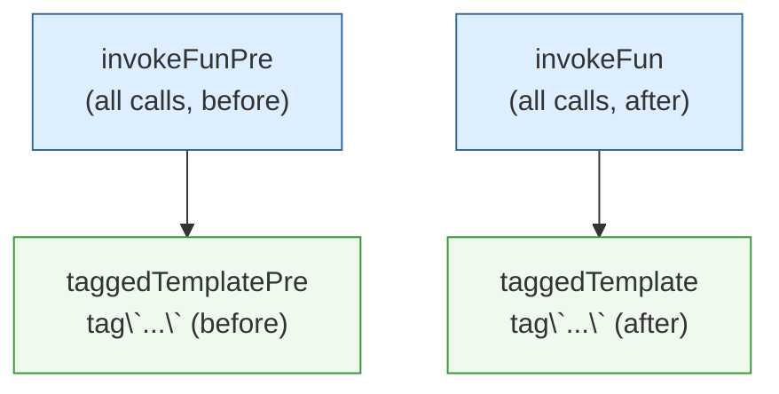
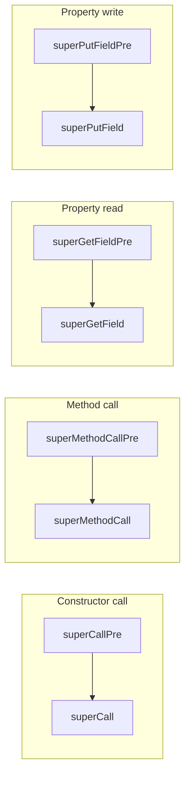
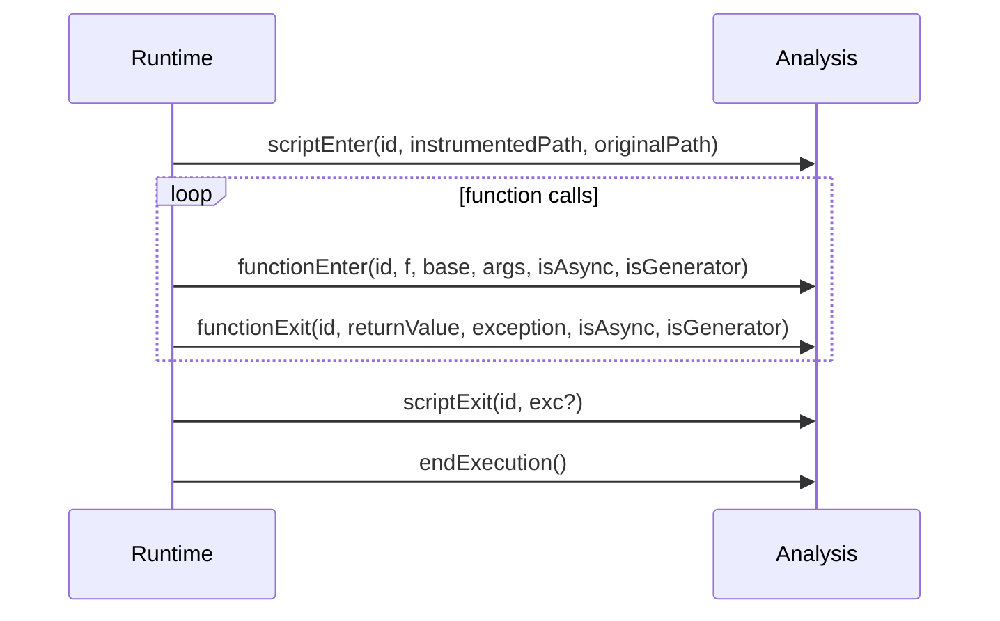
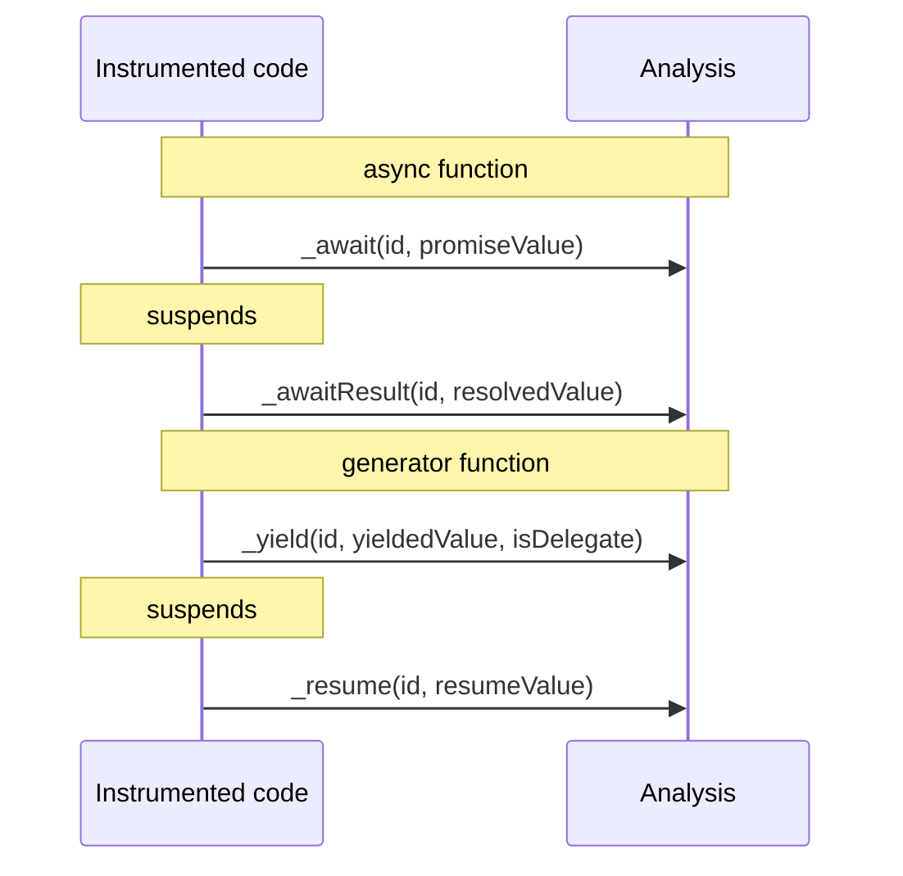

# Analysis Callbacks Reference

This document describes every callback available in the `Analysis` type
(`src/types/analysis.ts`). An analysis module is a JavaScript/TypeScript object
that implements any subset of these callbacks and is loaded at startup via the
`--analysis` option.

```js
(function (D$) {
  D$.analysis = {
    invokeFunPre(id, f, base, args, isConstructor, isMethod) {},
    invokeFun(id, f, base, args, result, isConstructor, isMethod) {},
  };
})(D$);
```

In **partial mode** (the practical default), the instrumenter inspects which
callbacks are actually defined and only activates the corresponding runtime
hooks. Implementing fewer callbacks keeps instrumentation overhead low.

---

## Core Concepts

### Source Location IDs

Every callback receives a numeric `id` as its first argument. This integer
uniquely identifies the source location (file + position) of the instrumented
site. You can use `D$.idToLoc(id)` to retrieve the original source information.

### Pre / Post Pairs

Operations that can be intercepted both _before_ and _after_ execution come in
paired callbacks:

| Pre (intercept inputs)   | Post (observe / replace output) |
| ------------------------ | ------------------------------- |
| `invokeFunPre`           | `invokeFun`                     |
| `taggedTemplatePre`      | `taggedTemplate`                |
| `getFieldPre`            | `getField`                      |
| `putFieldPre`            | `putField`                      |
| `_deletePre`             | `_delete`                       |
| `unaryPre`               | `unary`                         |
| `binaryPre`              | `binary`                        |
| `superCallPre`           | `superCall`                     |
| `superMethodCallPre`     | `superMethodCall`               |
| `superGetFieldPre`       | `superGetField`                 |
| `superPutFieldPre`       | `superPutField`                 |
| _(operator-specific)Pre_ | _(operator-specific)_           |

Returning `{ skip: true }` from a `*Pre` callback suppresses the actual
operation; the runtime passes a `skip` result directly to the corresponding
post callback.

### General / Specific Hierarchy

Several callback families follow a **general → specific** pattern. The _general_
callback fires for every member of a family; the _specific_ callback fires only
for the matching subset of operators or value types. When both are implemented:

1. The **general** callback fires first.
2. The **specific** callback fires second; its return value **takes precedence**.

This means you can implement only the general callback to observe everything, or
implement only a specific callback to handle one operator class efficiently.

---

## Callback Hierarchy Diagrams

### Unary Operations



_Arrows indicate dispatch order: general fires first, specific fires second._

---

### Binary Operations



---

### Condition Evaluation

Conditions have no Pre callback. The general `condition` callback receives an
`op` string that names the condition type.



---

### Literals

Literal callbacks have no Pre variant.



---

### Memory Access and Write

`memoryAccess` and `memoryWrite` are the general callbacks for all reads and
writes respectively. The specific callbacks narrow to either property access or
identifier access.



> `getFieldPre` / `putFieldPre` have Pre variants; `read` and `write` do not.

---

### Function Calls

`invokeFunPre` / `invokeFun` cover all function calls. Tagged template literals
are a specialized sub-case.



---

### Super Operations

> **Planned:** Super callbacks are currently isolated from the general callback
> hierarchy. A future revision will integrate them — for example, merging
> `superGetField` into the `getField` hierarchy, or providing a single unified
> callback that covers both ordinary and super variants of each operation.

Super operations are four independent Pre/Post pairs with no general/specific
relationship between them.



---

### Script and Function Lifecycle



---

### Async / Generator Suspension



---

## Complete Callback Reference

### Script Lifecycle

| Callback                                          | When it fires                                           |
| ------------------------------------------------- | ------------------------------------------------------- |
| `scriptEnter(id, instrumentedPath, originalPath)` | A script begins executing                               |
| `scriptExit(id, exc?)`                            | A script finishes (normally or via exception)           |
| `endExecution()`                                  | The process is about to exit after all scripts complete |

```js
(function (D$) {
  D$.analysis = {
    scriptEnter(id, instrumentedPath, originalPath) {},
    scriptExit(id, exc) {},
    endExecution() {},
  };
})(D$);
```

---

### Function Body

| Callback                                                         | When it fires            |
| ---------------------------------------------------------------- | ------------------------ |
| `functionEnter(id, f, base, args, isAsync, isGenerator)`         | Start of a function body |
| `functionExit(id, returnValue, exception, isAsync, isGenerator)` | End of a function body   |
| `_return(id, value)`                                             | A `return` statement     |

```js
(function (D$) {
  D$.analysis = {
    functionEnter(id, f, base, args, isAsync, isGenerator) {},
    functionExit(id, returnValue, exception, isAsync, isGenerator) {},
    _return(id, value) {
      // return { result: value } to replace the returned value
    },
  };
})(D$);
```

---

### Function Calls

| Callback                                                         | When it fires                                   | Returns                                        |
| ---------------------------------------------------------------- | ----------------------------------------------- | ---------------------------------------------- |
| `invokeFunPre(id, f, base, args, isConstructor, isMethod)`       | Before any call                                 | `{ f, base, args, skip }` \| `void`            |
| `invokeFun(id, f, base, args, result, isConstructor, isMethod)`  | After any call                                  | `{ result }` \| `void`                         |
| `taggedTemplatePre(id, f, base, strings, values, isMethod)`      | Before a tagged template (after `invokeFunPre`) | `{ f, base, strings, values, skip }` \| `void` |
| `taggedTemplate(id, f, base, strings, values, result, isMethod)` | After a tagged template (after `invokeFun`)     | `{ result }` \| `void`                         |

```js
(function (D$) {
  D$.analysis = {
    invokeFunPre(id, f, base, args, isConstructor, isMethod) {
      // return { f, base, args, skip: false } to replace inputs
      // return { f, base, args, skip: true } to suppress the call
    },
    invokeFun(id, f, base, args, result, isConstructor, isMethod) {
      // return { result } to replace the return value
    },
    taggedTemplatePre(id, f, base, strings, values, isMethod) {
      // return { f, base, strings, values, skip: false } to replace inputs
    },
    taggedTemplate(id, f, base, strings, values, result, isMethod) {
      // return { result } to replace the return value
    },
  };
})(D$);
```

---

### Property Access

| Callback                             | When it fires                                              | Returns                                 |
| ------------------------------------ | ---------------------------------------------------------- | --------------------------------------- |
| `getFieldPre(id, base, prop)`        | Before `obj.prop` / `obj[key]`                             | `{ base, prop, skip }` \| `void`        |
| `getField(id, base, prop, result)`   | After property read (specific; fires after `memoryAccess`) | `{ result }` \| `void`                  |
| `putFieldPre(id, base, prop, value)` | Before `obj.prop = v`                                      | `{ base, prop, value, skip }` \| `void` |
| `putField(id, base, prop, value)`    | After property write (specific; fires after `memoryWrite`) | `{ result }` \| `void`                  |
| `_deletePre(id, base, prop)`         | Before `delete obj.prop`                                   | `{ base, prop, skip }` \| `void`        |
| `_delete(id, base, prop, value)`     | After `delete obj.prop`                                    | `{ result: boolean }` \| `void`         |

```js
(function (D$) {
  D$.analysis = {
    getFieldPre(id, base, prop) {
      // return { base, prop, skip: false } to replace inputs
      // return { base, prop, skip: true } to suppress the read
    },
    getField(id, base, prop, result) {
      // return { result } to replace the read value
    },
    putFieldPre(id, base, prop, value) {
      // return { base, prop, value, skip: false } to replace inputs
      // return { base, prop, value, skip: true } to suppress the write
    },
    putField(id, base, prop, value) {
      // return { result } to replace the expression result
    },
    _deletePre(id, base, prop) {
      // return { base, prop, skip: true } to suppress deletion
    },
    _delete(id, base, prop, value) {
      // return { result: boolean } to replace the boolean result
    },
  };
})(D$);
```

---

### Variable Access

| Callback                                         | When it fires                                                   | Returns                |
| ------------------------------------------------ | --------------------------------------------------------------- | ---------------------- |
| `read(id, name, value)`                          | Variable identifier read (specific; fires after `memoryAccess`) | `{ result }` \| `void` |
| `write(id, names, value)`                        | Variable assignment (specific; fires after `memoryWrite`)       | `{ result }` \| `void` |
| `declare(id, name, kind, init, value, isSpread)` | Variable declaration                                            | `void`                 |

```js
(function (D$) {
  D$.analysis = {
    read(id, name, value) {
      // return { result } to replace the read value
    },
    write(id, names, value) {
      // names is an array to handle destructuring: const [a, b] = ...
      // return { result } to replace the assigned value
    },
    declare(id, name, kind, init, value, isSpread) {
      // kind: 'var' | 'let' | 'const' | 'param'
      // init: true if an initializer is present
    },
  };
})(D$);
```

---

### General Memory Callbacks

| Callback                  | Covers                            | Returns                |
| ------------------------- | --------------------------------- | ---------------------- |
| `memoryAccess(id, value)` | All reads (`getField` + `read`)   | `{ result }` \| `void` |
| `memoryWrite(id, value)`  | All writes (`putField` + `write`) | `{ result }` \| `void` |

These are the _general_ callbacks in the memory hierarchy. They fire before the
more specific `getField`/`read` and `putField`/`write` callbacks respectively.

```js
(function (D$) {
  D$.analysis = {
    memoryAccess(id, value) {
      // return { result } to replace the value (applies to all reads)
    },
    memoryWrite(id, value) {
      // return { result } to replace the value (applies to all writes)
    },
  };
})(D$);
```

---

### Unary Operations

| Callback                                 | Operators | Returns                           |
| ---------------------------------------- | --------- | --------------------------------- |
| `unaryPre(id, op, prefix, operand)`      | All unary | `{ op, operand, skip }` \| `void` |
| `unary(id, op, prefix, operand, result)` | All unary | `{ result }` \| `void`            |
| `arithmeticUnaryPre` / `arithmeticUnary` | `+` `-`   | same shapes                       |
| `logicalUnaryPre` / `logicalUnary`       | `!`       | same shapes                       |
| `bitwiseUnaryPre` / `bitwiseUnary`       | `~`       | same shapes                       |
| `typeofUnaryPre` / `typeofUnary`         | `typeof`  | same shapes                       |
| `voidUnaryPre` / `voidUnary`             | `void`    | same shapes                       |
| `updateUnaryPre` / `updateUnary`         | `++` `--` | same shapes                       |

```js
(function (D$) {
  D$.analysis = {
    unaryPre(id, op, prefix, operand) {
      // return { op, operand, skip: false } to replace inputs
      // return { op, operand, skip: true } to suppress the operation
    },
    unary(id, op, prefix, operand, result) {
      // return { result } to replace the computed value
    },

    // Operator-specific variants (fire after the general callbacks above)
    arithmeticUnaryPre(id, op, prefix, operand) {},
    arithmeticUnary(id, op, prefix, operand, result) {},
    logicalUnaryPre(id, op, prefix, operand) {},
    logicalUnary(id, op, prefix, operand, result) {},
    typeofUnaryPre(id, op, prefix, operand) {},
    typeofUnary(id, op, prefix, operand, result) {},
    updateUnaryPre(id, op, prefix, operand) {},
    updateUnary(id, op, prefix, operand, result) {},
  };
})(D$);
```

---

### Binary Operations

| Callback                                   | Operators                                                 | Returns                               |
| ------------------------------------------ | --------------------------------------------------------- | ------------------------------------- |
| `binaryPre(id, op, left, right)`           | All binary                                                | `{ op, left, right, skip }` \| `void` |
| `binary(id, op, left, right, result)`      | All binary                                                | `{ result }` \| `void`                |
| `arithmeticBinaryPre` / `arithmeticBinary` | `+` `-` `*` `/` `%` `**`                                  | same shapes                           |
| `comparisonBinaryPre` / `comparisonBinary` | `==` `!=` `===` `!==` `<` `<=` `>` `>=` `in` `instanceof` | same shapes                           |
| `bitwiseBinaryPre` / `bitwiseBinary`       | `&` `\|` `^` `<<` `>>` `>>>`                              | same shapes                           |

```js
(function (D$) {
  D$.analysis = {
    binaryPre(id, op, left, right) {
      // return { op, left, right, skip: false } to replace inputs
      // return { op, left, right, skip: true } to suppress the operation
    },
    binary(id, op, left, right, result) {
      // return { result } to replace the computed value
    },

    // Operator-specific variants (fire after the general callbacks above)
    arithmeticBinaryPre(id, op, left, right) {},
    arithmeticBinary(id, op, left, right, result) {},
    comparisonBinaryPre(id, op, left, right) {},
    comparisonBinary(id, op, left, right, result) {},
    bitwiseBinaryPre(id, op, left, right) {},
    bitwiseBinary(id, op, left, right, result) {},
  };
})(D$);
```

---

### Conditions

All condition callbacks share the signature `(id, value) => { result } | void`.

| Callback                   | Condition site                             |
| -------------------------- | ------------------------------------------ |
| `condition(id, op, value)` | All conditions (also receives `op` string) |
| `ifCondition`              | `if` / `else if`                           |
| `whileCondition`           | `while` / `do-while`                       |
| `forCondition`             | `for` loop test                            |
| `ternaryCondition`         | `? :`                                      |
| `logicalAnd`               | `&&` (left-hand side)                      |
| `logicalOr`                | `\|\|` (left-hand side)                    |
| `nullishCoalescing`        | `??` (left-hand side)                      |
| `optionalChain`            | `?.` (guard)                               |
| `switchCondition`          | `switch` discriminant                      |

```js
(function (D$) {
  D$.analysis = {
    condition(id, op, value) {
      // op: 'if' | 'while' | 'do-while' | 'for' | '?' |
      //     '&&' | '||' | '??' | '?.' | 'switch'
      // return { result } to replace the condition value
    },

    // Condition-specific variants (fire after the general callback above)
    ifCondition(id, value) {},
    whileCondition(id, value) {},
    forCondition(id, value) {},
    ternaryCondition(id, value) {},
    logicalAnd(id, value) {},
    logicalOr(id, value) {},
    nullishCoalescing(id, value) {},
    optionalChain(id, value) {},
    switchCondition(id, value) {},
  };
})(D$);
```

---

### Literals

All literal callbacks share the signature `(id, value) => { result } | void`.

| Callback          | Value type                            |
| ----------------- | ------------------------------------- |
| `literal`         | All literals                          |
| `numberLiteral`   | `number`                              |
| `bigintLiteral`   | `bigint`                              |
| `stringLiteral`   | `string`                              |
| `booleanLiteral`  | `boolean`                             |
| `nullLiteral`     | `null`                                |
| `regexpLiteral`   | `RegExp`                              |
| `arrayLiteral`    | `Array`                               |
| `objectLiteral`   | plain `object`                        |
| `functionLiteral` | `function` / arrow / class expression |

```js
(function (D$) {
  D$.analysis = {
    literal(id, value) {
      // return { result } to replace the literal value
    },

    // Type-specific variants (fire after the general callback above)
    numberLiteral(id, value) {},
    bigintLiteral(id, value) {},
    stringLiteral(id, value) {},
    booleanLiteral(id, value) {},
    nullLiteral(id, value) {},
    regexpLiteral(id, value) {},
    arrayLiteral(id, value) {},
    objectLiteral(id, value) {},
    functionLiteral(id, value) {},
  };
})(D$);
```

---

### Super Operations

| Callback                                           | Operation                  | Returns                     |
| -------------------------------------------------- | -------------------------- | --------------------------- |
| `superCallPre(id, args)`                           | Before `super(...)`        | `{ args }` \| `void`        |
| `superCall(id, args, thisVal)`                     | After `super(...)`         | `{ result }` \| `void`      |
| `superMethodCallPre(id, thisVal, prop, args)`      | Before `super.method(...)` | `{ prop, args }` \| `void`  |
| `superMethodCall(id, thisVal, prop, args, result)` | After `super.method(...)`  | `{ result }` \| `void`      |
| `superGetFieldPre(id, thisVal, prop)`              | Before `super.prop` read   | `{ prop }` \| `void`        |
| `superGetField(id, thisVal, prop, value)`          | After `super.prop` read    | `{ result }` \| `void`      |
| `superPutFieldPre(id, thisVal, prop, value)`       | Before `super.prop = v`    | `{ prop, value }` \| `void` |
| `superPutField(id, thisVal, prop, value)`          | After `super.prop = v`     | `void`                      |

```js
(function (D$) {
  D$.analysis = {
    superCallPre(id, args) {
      // return { args } to replace the arguments
    },
    superCall(id, args, thisVal) {
      // return { result } to replace the newly constructed this
    },
    superMethodCallPre(id, thisVal, prop, args) {
      // return { prop, args } to replace method name or arguments
    },
    superMethodCall(id, thisVal, prop, args, result) {
      // return { result } to replace the return value
    },
    superGetFieldPre(id, thisVal, prop) {
      // return { prop } to redirect to a different property
    },
    superGetField(id, thisVal, prop, value) {
      // return { result } to replace the read value
    },
    superPutFieldPre(id, thisVal, prop, value) {
      // return { prop, value } to replace property name or value
    },
    superPutField(id, thisVal, prop, value) {},
  };
})(D$);
```

---

### Other Callbacks

| Callback                                   | When it fires                          | Returns                |
| ------------------------------------------ | -------------------------------------- | ---------------------- |
| `endExpression(id, value)`                 | End of an expression statement         | `void`                 |
| `forInOfObject(id, value, isForIn)`        | Before a `for-in` / `for-of` loop      | `{ result }` \| `void` |
| `fieldInit(id, obj, key, isStatic, value)` | Class field initializer evaluation     | `{ result }` \| `void` |
| `_throw(id, val)`                          | `throw` statement                      | `{ result }` \| `void` |
| `_yield(id, value, isDelegate)`            | `yield` / `yield*` expression          | `{ result }` \| `void` |
| `_resume(id, value)`                       | Generator `.next(val)` resume          | `{ result }` \| `void` |
| `_await(id, value)`                        | `await` expression (before suspension) | `{ result }` \| `void` |
| `_awaitResult(id, value)`                  | `await` resumes with resolved value    | `{ result }` \| `void` |

```js
(function (D$) {
  D$.analysis = {
    endExpression(id, value) {},
    forInOfObject(id, value, isForIn) {
      // isForIn: true for for-in, false for for-of
      // return { result } to replace the iterable
    },
    fieldInit(id, obj, key, isStatic, value) {
      // return { result } to replace the initialized value
    },
    _throw(id, val) {
      // return { result } to replace the thrown value
    },
    _yield(id, value, isDelegate) {
      // isDelegate: true for yield*
      // return { result } to replace the yielded value
    },
    _resume(id, value) {
      // value: the argument passed to generator.next(value)
      // return { result } to replace the resume value
    },
    _await(id, value) {
      // return { result } to replace the awaited promise/value
    },
    _awaitResult(id, value) {
      // return { result } to replace the resolved value
    },
  };
})(D$);
```
